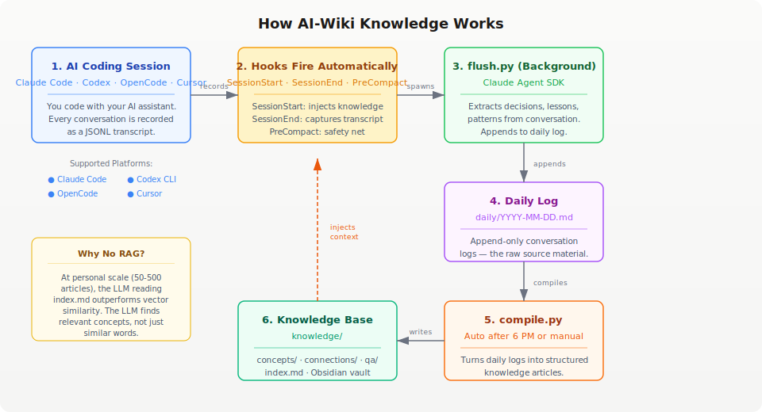

# AI-Wiki Knowledge Base

**Your AI conversations compile themselves into a searchable knowledge base.**

Works with **Claude Code**, **OpenAI Codex CLI**, **OpenCode CLI**, and **Cursor IDE/CLI**. Adapted from [Karpathy's LLM Knowledge Base](https://gist.github.com/karpathy/442a6bf555914893e9891c11519de94f) architecture, but instead of clipping web articles, the raw data is your own AI coding conversations. When a session ends (or auto-compacts mid-session), hooks capture the conversation transcript and spawn a background process that uses the [Claude Agent SDK](https://github.com/anthropics/claude-agent-sdk) to extract the important stuff - decisions, lessons learned, patterns, gotchas - and appends it to a daily log. You then compile those daily logs into structured, cross-referenced knowledge articles organized by concept. Retrieval uses a simple index file instead of RAG - no vector database, no embeddings, just markdown.

## API Costs and Subscriptions

This system uses the [Claude Agent SDK](https://github.com/anthropics/claude-agent-sdk) for memory extraction (the `flush.py` background process). Here's what you need to know about costs:

| Platform | What you need | Cost |
|----------|--------------|------|
| **Claude Code** | Claude Max, Team, or Enterprise subscription | Included — personal use of the Agent SDK is covered |
| **Codex CLI** | ChatGPT Plus, Pro, Business, or Enterprise | Uses your plan's credits — no separate API key needed |
| **OpenCode** | Any API key (Anthropic, OpenAI, Google, etc.) | Pay per your model provider's rates, or use OpenCode Go ($10/mo) |
| **Cursor** | Cursor Pro, Business, or Enterprise | Uses your plan's credits — no separate API key needed |

OpenCode itself is free and open-source — you only pay for the models you connect to it.

## Quick Start

### Fresh Project (no existing files)

1. Clone this repo into your project:
   ```bash
   git clone https://github.com/paulboutin/AI-Wiki-knowledge.git
   cd AI-Wiki-knowledge
   uv sync
   ```

2. The hooks are already configured — they activate automatically when you open your AI coding tool in this project.

### Existing Project (has AGENTS.md, pyproject.toml, etc.)

Use the install script — it merges without overwriting:

```bash
# Clone into a temp directory
git clone https://github.com/paulboutin/AI-Wiki-knowledge.git /tmp/ai-wiki

# Run the installer (dry run first to preview)
cd /tmp/ai-wiki
uv run python scripts/install.py /path/to/your/project --dry-run

# Install for real
uv run python scripts/install.py /path/to/your/project

# Clean up
rm -rf /tmp/ai-wiki
```

The install script:
- **Merges** `.gitignore` entries (doesn't overwrite)
- **Merges** `pyproject.toml` dependencies (doesn't overwrite)
- **Backs up** existing `AGENTS.md` and appends the knowledge base schema
- **Creates** missing directories (`hooks/`, `scripts/`, `knowledge/`, etc.)
- **Skips** files that already exist (your `LICENSE`, `AGENTS.md`, etc.)
- **Copies** hook configs (`.claude/`, `.cursor/`, `.codex/`, `.opencode/`)

### Claude Code

1. Clone this repo into your project:
   ```bash
   git clone https://github.com/paulboutin/AI-Wiki-knowledge.git
   cd AI-Wiki-knowledge
   uv sync
   ```

2. The hooks are already configured in `.claude/settings.json` - they activate automatically when you open Claude Code in this project.

### Codex CLI

1. Clone this repo into your project:
   ```bash
   git clone https://github.com/paulboutin/AI-Wiki-knowledge.git
   cd AI-Wiki-knowledge
   uv sync
   ```

2. Enable hooks in your `~/.codex/config.toml`:
   ```toml
   [features]
   codex_hooks = true
   ```

3. The repo-local hooks in `.codex/hooks.json` activate automatically when you run Codex in this project.

### OpenCode CLI/TUI

1. Clone this repo into your project:
   ```bash
   git clone https://github.com/paulboutin/AI-Wiki-knowledge.git
   cd AI-Wiki-knowledge
   uv sync
   ```

2. Verify your setup:
   ```bash
   uv run python scripts/check-deps.py
   ```
   This checks for Python 3.12+, `uv`, `bun`, and OpenCode version compatibility.

3. The plugin in `.opencode/plugins/` activates automatically when you run OpenCode in this project.

   **Note:** Hooks only work with the CLI/TUI version, not the web version.

### Cursor IDE/CLI

1. Clone this repo into your project:
   ```bash
   git clone https://github.com/paulboutin/AI-Wiki-knowledge.git
   cd AI-Wiki-knowledge
   uv sync
   ```

2. The hooks are already configured in `.cursor/hooks.json` — they activate automatically when you open Cursor in this project.

3. If using Cursor's "Third-party skills" compatibility mode: enable it in **Settings → Features → Third-party skills**.

From there, your conversations start accumulating. After 6 PM local time, the next session flush automatically triggers compilation of that day's logs into knowledge articles. You can also run `uv run python scripts/compile.py` manually at any time.

## How It Works



## Key Commands

```bash
uv run python scripts/compile.py                    # compile new daily logs
uv run python scripts/query.py "question"            # ask the knowledge base
uv run python scripts/query.py "question" --file-back # ask + save answer back
uv run python scripts/lint.py                        # run health checks
uv run python scripts/lint.py --structural-only      # free structural checks only
```

## Platform Comparison

| Feature | Claude Code | Codex CLI | OpenCode CLI/TUI | Cursor IDE/CLI |
|---------|-------------|-----------|------------------|----------------|
| Session start context injection | SessionStart hook | SessionStart hook | session.start hook | sessionStart hook |
| Session end capture | SessionEnd hook | Stop hook | session.stopping hook | sessionEnd hook |
| Pre-compaction safety net | PreCompact hook | Not available | Not available | preCompact hook |
| Fallback | N/A | N/A | tool.execute.after | N/A |
| Hook config | `.claude/settings.json` | `.codex/hooks.json` + `config.toml` flag | `.opencode/plugins/` (auto-discover) | `.cursor/hooks.json` |
| Transcript format | JSONL | JSONL | JSONL | JSONL |
| Web support | N/A | N/A | No (CLI/TUI only) | IDE + CLI |

**Notes:**
- Codex does not have a `PreCompact` event equivalent. Long-running Codex sessions may lose intermediate context to auto-compaction before the `Stop` hook fires.
- OpenCode's `session.start` and `session.stopping` hooks require OpenCode 0.2.0+. The `tool.execute.after` fallback works on older versions.
- OpenCode hooks only work with the CLI/TUI version, not the web version.
- Cursor hooks work in both the IDE and CLI modes. Enable "Third-party skills" in Cursor Settings if using Claude Code compatibility mode.
- For critical sessions on any platform, run `compile.py` manually before the session ends.

## Why No RAG?

Karpathy's insight: at personal scale (50-500 articles), the LLM reading a structured `index.md` outperforms vector similarity. The LLM understands what you're really asking; cosine similarity just finds similar words. RAG becomes necessary at ~2,000+ articles when the index exceeds the context window.

## Team Usage

This knowledge base is designed for shared team learning. Each developer's conversations are captured locally, but the compiled knowledge is shared across the team.

### How It Works

- **Daily logs are personal** — your `daily/` folder is gitignored, your conversations stay private
- **Knowledge is shared** — compiled articles in `knowledge/` are tracked in git for the whole team
- **Automatic sync** — `compile.py` handles git pull/commit/push automatically
- **LLM deduplication** — detects when multiple developers discuss similar topics and merges them into one article
- **Contributor attribution** — every article tracks who contributed to it via `git config user.name`

### Setup for Teams

1. Clone this repo into your project
2. Each developer uses their preferred AI coding tool (Claude Code, Cursor, Codex, OpenCode)
3. Hooks fire automatically — no extra configuration needed
4. Knowledge compiles automatically after 6 PM or when you run `compile.py`

### Onboarding a New Team Member

When a new developer joins the project, they simply pull the repo. Here's what happens:

```bash
# New developer clones the project
git clone https://github.com/your-org/your-project.git
cd your-project
uv sync
```

**What they get immediately:**
- **`knowledge/`** — the full shared knowledge base, already compiled from the team's past sessions
- **Hooks** — configured and ready to fire on their first AI session
- **Scripts** — `compile.py`, `query.py`, `lint.py` all available

**What starts empty (personal):**
- **`daily/`** — created automatically on their first session, gitignored, theirs alone
- **`scripts/state.json`** — tracks their personal compilation state, gitignored

**What they should do:**
1. Make sure `git config user.name` is set (used for contributor attribution)
2. Start using their AI coding tool — hooks fire automatically
3. Run `uv run python scripts/query.py "what does this project know?"` to explore the existing knowledge base

**What they should NOT do:**
- Don't manually edit `knowledge/` articles — let the compiler handle it
- Don't commit `daily/` files — they're personal and gitignored
- Don't share `scripts/state.json` — it's machine-specific

### Conflict Resolution

If two developers compile at the same time:
- File locking prevents concurrent compilation on the same machine
- `git pull --rebase` + retry handles cross-machine conflicts
- Push retries up to 3 times before failing gracefully

## Viewing Your Knowledge in Obsidian

The knowledge base is pure markdown with Obsidian-style `[[wikilinks]]` — it works natively as an Obsidian vault.

### Quick Setup

1. Open Obsidian
2. **Open folder as vault** → select the `knowledge/` directory
3. That's it — your knowledge base is now a fully functional vault

### What You Get

- **Graph View** — visualize how concepts connect. Each `[[wikilink]]` becomes an edge in the graph, revealing clusters of related knowledge.
- **Backlinks panel** — see every article that links to the one you're reading. This is the compiled knowledge's cross-reference system in action.
- **Full-text search** — instant search across all articles, daily logs, and Q&A entries.
- **Outline view** — navigate article structure with the built-in outline pane.
- **Tag browsing** — click any tag in an article's frontmatter to see all related articles.

### Recommended Settings

| Setting | Value | Why |
|---------|-------|-----|
| Strict frontmatter | On | Ensures YAML frontmatter is valid |
| Detect all file extensions | On | Reads `.md` files correctly |
| Use `[[wikilinks]]` | On (default) | Native support, no config needed |
| Default location for new notes | Same folder as current note | Keeps articles organized |

### Pro Tips

- **Graph View filters**: Filter by folder (`concepts/`, `connections/`, `qa/`) to focus on specific knowledge types.
- **Starred articles**: Star frequently referenced articles for quick access from the sidebar.
- **Canvas**: Use Obsidian Canvas to manually map relationships between concepts for complex topics.
- **Daily Notes**: The `daily/` directory can also be added as a secondary vault or viewed alongside — useful for reviewing raw session logs.

### Mobile Access

Sync the `knowledge/` folder via Obsidian Sync, iCloud, or any file sync service to browse your knowledge base on mobile. The markdown format is fully portable — no proprietary database or lock-in.

## Technical Reference

See **[AGENTS.md](AGENTS.md)** for the complete technical reference: article formats, hook architecture, script internals, cross-platform details, costs, and customization options. AGENTS.md is designed to give an AI agent everything it needs to understand, modify, or rebuild the system.
